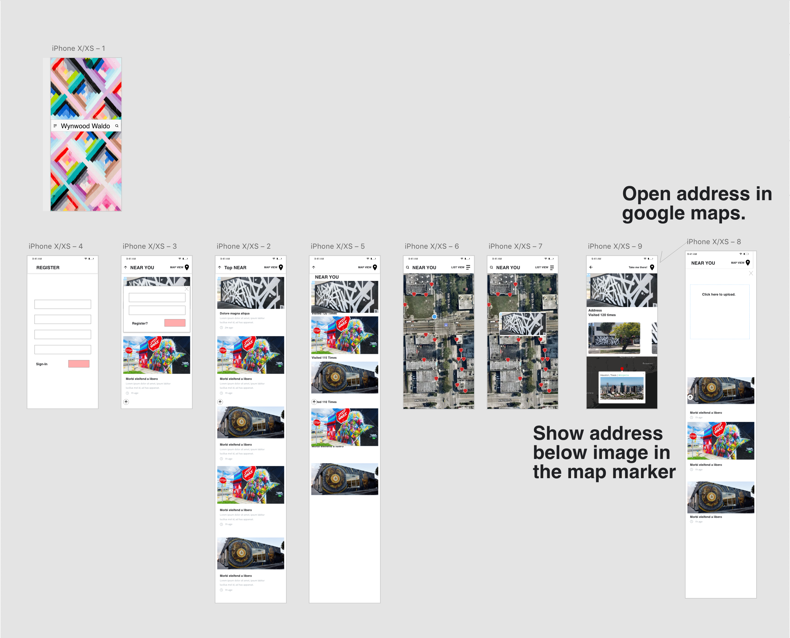
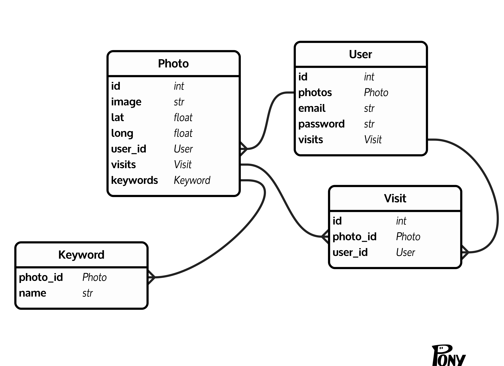

# Final Project

## Wireframe

## ERD

^^`visits` and `keywords` are not attributes of the `Photo` or `User` models -- AW
^^ Images will be handled through `ActiveStorage`: https://edgeguides.rubyonrails.org/active_storage_overview.html#has-one-attached

## Deployment

If your project uses the `react_on_rails` gem, you will need to:

- `heroku create your-app-name`
- `heroku buildpacks:set --index 1 heroku/nodejs`
- `heroku buildpacks:add heroku/ruby`
- `git push heroku master`
- `heroku run rails db:migrate`
- optional: `heroku run rails db:seed`

## Instructor Checklist

- Clone this repo, create a new one
- Set branch protection rules on `master` (There is a CODEOWNERS file in this repo, but it is up to you how you want to use it.)
- Create a Slack Channel, invite team members and TAs
- in Slack: `/github subscribe wyncode/repo_name issues,reviews,comments`
